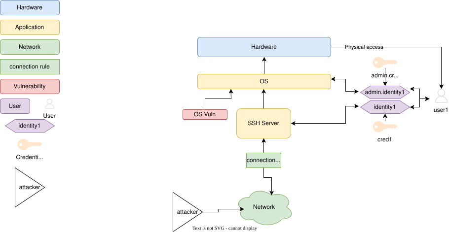
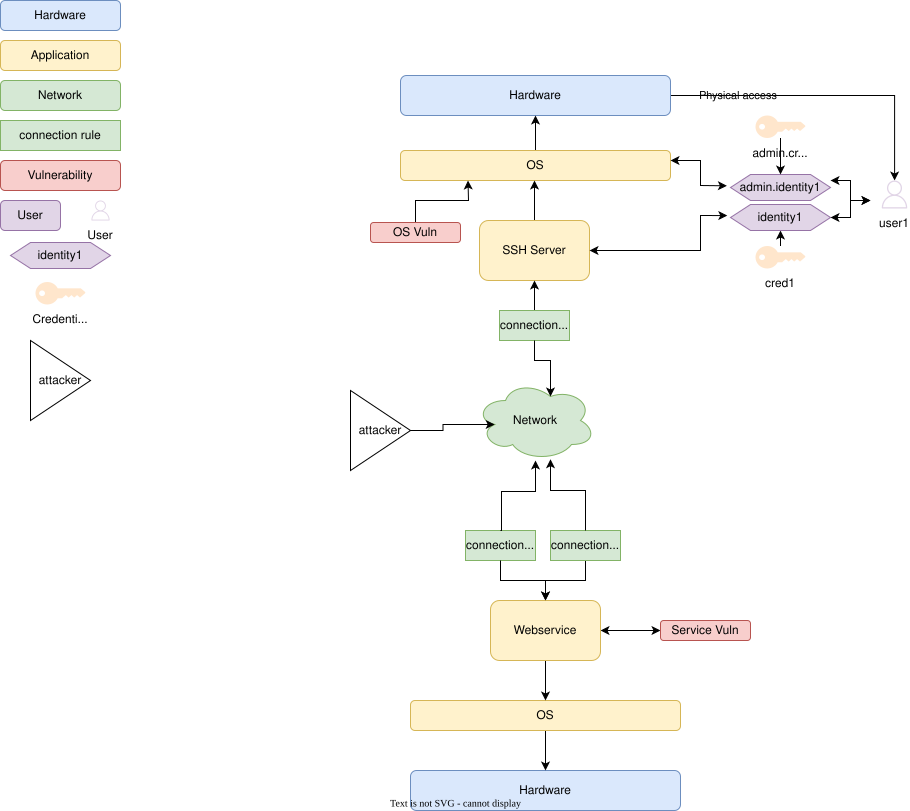

# Tutorial 2: Create a small model using CoreLang
This tutorial will describe on how to generate a model with realistic like assets and associations using [CoreLang](https://github.com/mal-lang/coreLang).
In this tutorial a model will be create from an simple architecture to a MAL model using the Python library [mal-toolbox](https://github.com/mal-lang/mal-toolbox).
This will cover the requirements, as well as on how to interpret a MAL language, in this case CoreLang.
The code for generating the model can be found in `model.py`.

## Prerequisites
### Requirements
This project requires `Python3` and `Pip3` and we would recommend creating a virtual environment for this project.
The create a new environment and install the required dependencies, use the following commands:
```bin/bash
python3 -m venv .venv
source .venv/bin/activate
pip3 install -r requirements.txt
```

Next, in order to create a MAL model, it is required to have a MAL language file.
Since we are using CoreLang, it is required to retrieve this or compile the language yourself.
Instructions on how to do this is specified [here](https://github.com/mal-lang/mal-toolbox-tutorial/blob/main/guides/compile_language.md).

### Understanding the Meta Attack Language
To be able to create a MAL model for a specific language, it is neccasery to interpret which assets associations are available.
Since this tutorial will use CoreLang, we will only focus on this language.
The CoreLang language definitions can be found [here](https://github.com/mal-lang/coreLang/tree/master/src/main/mal).

Let's start of with by inspecting `ComputerResources.mal` from [here](https://github.com/mal-lang/coreLang/blob/master/src/main/mal/ComputeResources.mal).
In this file, the assets (nodes) such as `Hardware` and `Application` are defined with their underlying properties, as well as the possible assocations (edges) between assets at the end of the file.
To keep it simple, you can ignore all the underlying properties and only focus on the assets and their associations.
Assets are usually specified first in the file and at the bottom the associations are specified.
It is important to understand that assocations are only possible between certain assets.
An example association between `Hardware` and `Application` is given below:
```
Hardware         [hostHardware]      0..1 <-- SysExecution          --> *    [sysExecutedApps]        Application
```
The association specified above describes the relation between the assets `Hardware` and `Application`, which is called `SysExecution`.
Specifically, `Hardware` can draw any number of edges as specified by `*` to `Application`, labeled as `sysExecutedApps`.
`Application` can draw 0 or 1 edge to `Hardware`, as specified by `0..1`, labeled as `hostHardware`.
So `Hardware` can run any number of applications, while `Application` can run only on a single piece of hardware.

**_Note:_** It is ofcourse possible that associations exists between assets in different files.
Example: `PhysicalZone` in `ComputerResources.mal` and `Network` in `Networking.mal`.
See:
```
PhysicalZone     [physicalZones]        * <-- ZoneInclusion         --> *    [networks]               Network
```

## Modelling
Once you have specified and understand the Meta Attack Language chosen, you can model the infrastructure using the specified language.
This section will cover how to convert your infrastructure to MAL, as well as actually implementing the code to create such a model.

### Architecture to MAL
Before starting to model using MAL, it is important to onderstand what is and what is not possible using the chosen language.
For our first use case, we want to model an asset which hosts a SSH server and is connected to the network.
Besides that, the operating system has an vulnerability and there is a user who has admin rights on it, as well as normal user rights on the SSH server.

To translate such a scenario to CoreLang, we can define it by saying that a machine consists of some hardware and an operating system. On this operating system there can be multiple applications. Both the operating system and any application can have a vulnerability.

An overview of this model is shown below.



A more complex model with multiple assets is shown below, with a second asset.


### Architecture to Model
```Python
language_graph = LanguageGraph.from_mar_archive(language_path)
        model = Model("Tutorial2 Model", language_graph)
```
It is important to keep in mind that **when adding an association between a node, the reverse association will automatically be added**.